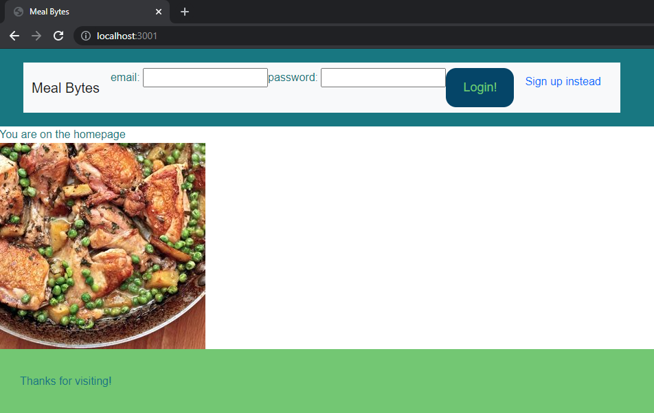

# meal-bytes

Dependencies

Mysql  
mysql2  
nodemon  
handlebars-express  
express  
sequelize  
handlebars  
dotenv  

# Meal Bytes

  

  ## Description 
  
  Meal Bytes is a website that allows a user to input all of the ingredients that are already in their kitchen into our database. They then submit the information and a selection of recipes will pop up with only the selected ingredients. Users also have the option to include dietary restrictions (i.e. gluten free, vegitarian, etc) and add their own comments. Recipes can be saved to a user's profile for them to come back to later. They also have the option to change the ingredients on their list at any time to populate new recipes. This is a cost-efficient and creative way to utilize any and all items in your kitchen instead of going to the store.
  Our project stands out by its flexibility and efficiency. No need to leave the house. No need to spend money. No need to waste food. You get to choose the array of ingredients you want to choose from. You choose the dietary restrictions. No more items that sit in the back of your fridge or pantry until they expire and are never eaten. No more wasted time or food. The motivation behind Meal Bytes is a cost-efficient and creative way to utilize any and all items in your kitchen instead of going to the store. Whether the reason is saving money, trying a new recipe or just not wanting to leave the house, Meal Bytes is a resource for letting a person think outside their cooking comfort zone and try something new with what is already there.
  

  ## Table of Contents
  
  * [Installation](#installation)
  * [Usage](#usage)
  * [Contributing](#Contributing)
  * [Tests](#tests)
  * [Questions](#questions)
  * [License](#license)
  
  
  ## Installation
  
  Go to the live website at (https://pure-wildwood-98439.herokuapp.com/)
  
  
  ## Usage 
  
  
  
  
  ## Contributing

  
  
  [Contributor Covenant](https://www.contributor-covenant.org/version/2/0/code_of_conduct/)

  ## Tests
  
  No tests provided

  ## Questions

  You can checkout my repos here: [https://github.com/jfocha](https://github.com/jfocha)

  For further questions, I can also be reached at jfocha@gmail.com; ga-kit@hotmail.com; rayray9744@gmail.com; Shahabgeravesh@gmail.com

  ## License
  
  Copyright (c) 2021 by Shahab Geravesh, Joseph Focha, Rayell McMahan, Jiajie "Jay" Chen

  This application license is covered under [MIT License](https://choosealicense.com/licenses/mit/)
  
  Permission is hereby granted, free of charge, to any person obtaining a copy of this software and associated documentation files (the 'Software'), to deal in the Software without restriction, including without limitation the rights to use, copy, modify, merge, publish, distribute, sublicense, and/or sell copies of the Software, and to permit persons to whom the Software is furnished to do so, subject to the following conditions:     The above copyright notice and this permission notice (including the next paragraph) shall be included in all copies or substantial portions of the Software.     THE SOFTWARE IS PROVIDED 'AS IS', WITHOUT WARRANTY OF ANY KIND, EXPRESS OR IMPLIED, INCLUDING BUT NOT LIMITED TO THE WARRANTIES OF MERCHANTABILITY, FITNESS FOR A PARTICULAR PURPOSE AND NONINFRINGEMENT. IN NO EVENT SHALL THE AUTHORS OR COPYRIGHT HOLDERS BE LIABLE FOR ANY CLAIM, DAMAGES OR OTHER LIABILITY, WHETHER IN AN ACTION OF CONTRACT, TORT OR OTHERWISE, ARISING FROM, OUT OF OR IN CONNECTION WITH THE SOFTWARE OR THE USE OR OTHER DEALINGS IN THE SOFTWARE.
  
  ---

